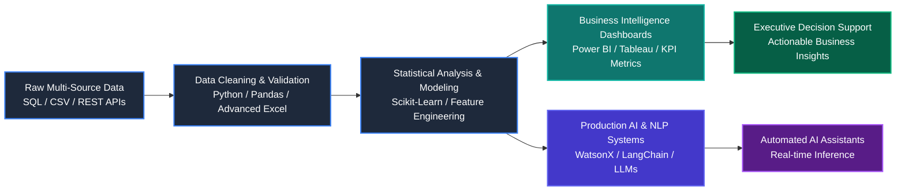

# 👨‍💻 Deepak Polisetti

### **Data Analyst | Business Intelligence Specialist | AI & ML Engineer**

  
  
  
  
  

---

## 📌 Executive Summary

Results-driven **Data Analyst & AI/ML Engineer** with a strong foundation in exploratory data analysis, business intelligence, predictive modeling, and scalable NLP solutions. Experienced in building enterprise-grade chatbots and ESG emission forecasting pipelines through internships at **IBM (Edunet)** and **Shell India**.

- 🎓 **Education:** B.Tech in Computer Science (AI & ML) at **Uttaranchal University** (CGPA: **8.61 / 10.0**, SGPA: **9.04**).
- 💼 **Industry Experience:** AI & Cloud Intern @ **IBM / Edunet** | Data Analytics Intern @ **Shell India**.
- 🔬 **Research & Innovation:** Presented research paper on *AI Governance & Policy* at **ICASDGAI-2025**.
- 🛠️ **Core Strengths:** Data cleaning, ETL, KPI dashboards, statistical analysis, NLP pipelines, and LLM orchestration (RAG, LangChain, WatsonX).

---

## 🔄 End-to-End Analytics & AI Workflow

---

## 🚀 Highlight Projects

| Project | Tech Stack | Key Highlights | Links |
| :--- | :--- | :--- | :---: |
| **EmotionLens — NLP Sentiment Platform** | Python, Scikit-Learn, TF-IDF, NLP, Vercel | Trained on **1.6M tweets** (Sentiment140) with **81.6% accuracy**; deployed interactive web app for real-time sentiment scoring. | [Live Demo](https://emotion-lens-model.vercel.app/) \| [Repo](https://github.com/DEEPAK21072005/Emotion-Detection-Using-NLP) |
| **AI Career Assistant (CareerBot)** | IBM WatsonX, Python, NLP, RAG, IBM Cloud | Built conversational AI assistant on IBM WatsonX with RAG pipeline; reduced manual query handling by **40%**. | [Details](#) |
| **GHG Emissions Forecasting & ESG Dashboard** | Python, Scikit-Learn, Power BI, ESG Datasets | Modeled 5-year emissions trends using regression algorithms; designed executive Power BI reporting dashboards. | [Details](#) |
| **AI Bilingual Grammar Coach** | Python, Google DeepMind Gemma 2B, Prompt Eng. | Built for Google DeepMind Impact Challenge; provides intelligent, zero-latency offline grammar corrections and explanations. | [Details](#) |
| **Fake News Detection Engine** | Python, NLP, TF-IDF, Logistic Regression | Developed high-precision classification model on **20,000+ news articles** achieving **92% precision**. | [Details](#) |

---

## 🛠️ Technical Skills Matrix

### 💻 Programming & Databases

### 📊 Data Analytics & Business Intelligence

### 🧠 AI, Machine Learning & NLP

### ☁️ Cloud & Developer Tools

---

## 💼 Professional Experience & Simulations

- **IBM AI & Cloud Intern** — *Edunet Foundation × AICTE* `(Jul 2025 – Aug 2025)`
  - Engineered WatsonX AI chatbot, reducing query resolution turnaround by 40%.
  - Built Python data pipelines on IBM Cloud with real-time decision support capabilities.
- **Shell Green Skills Intern** — *Shell India × AICTE* `(Jul 2025 – Aug 2025)`
  - Formulated GHG emissions predictive models and built interactive Power BI ESG reporting dashboards.
  - Handled data cleaning, validation, and reconciliation across multi-year energy datasets.
- **Industry Job Simulations (Forage)**
  - **JP Morgan:** Software Engineering & Investment Banking
  - **Deloitte:** Data Analytics & Technology Solutions
  - **Tata:** Data Visualisation & GenAI Powered Analytics
  - **Quantium:** Commercial Data Analytics

---

## 📜 Key Certifications & Honors (Selected)

- 🏆 **IBM SkillsBuild:** *AI & Cloud Mastery* \| *RAG with LangChain* \| *Document Retrieval with IBM Granite & Docling*
- 🏆 **Google Cloud:** *Generative AI Studio Essentials*
- 🏆 **AWS:** *Introduction to AWS Cloud Adoption Framework (CAF)*
- 🏆 **Research Presentation:** *AI Governance & Policy* presented at international conference **ICASDGAI-2025**
- 🏆 **PCDS Assessment:** Scored **100% (Grade A+)** in Professional Numerical Aptitude & Logical Reasoning

---

## 📊 GitHub Analytics & Activity

 

---

## 📬 Let's Connect!

I am actively seeking full-time opportunities and internships in **Data Analytics**, **Business Intelligence**, and **AI/ML Engineering**.

